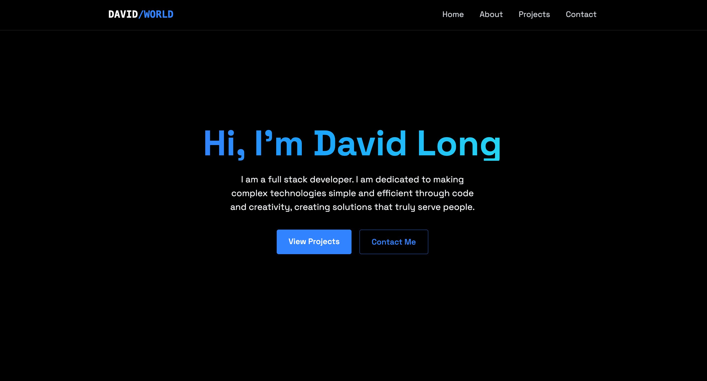
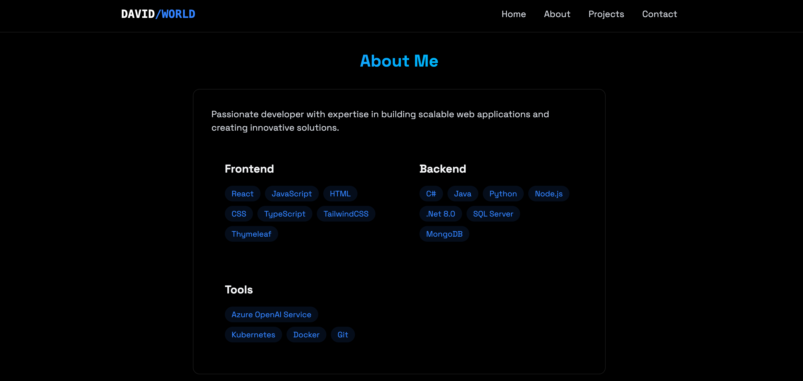
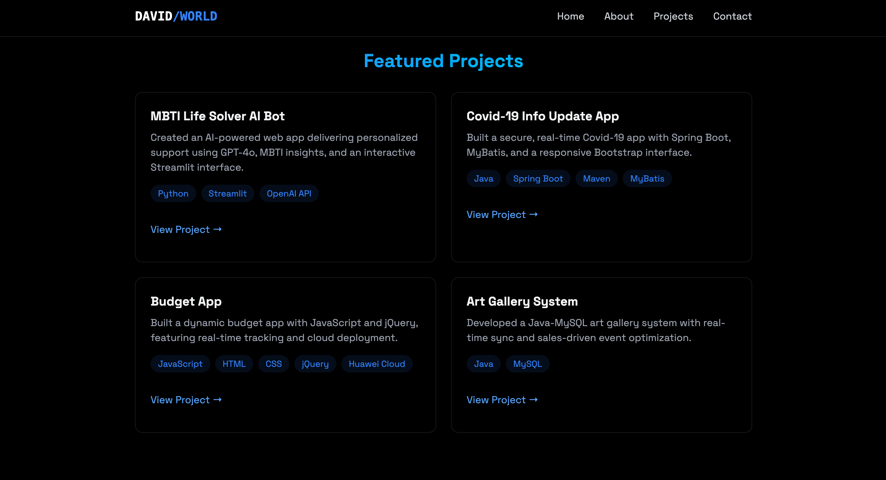
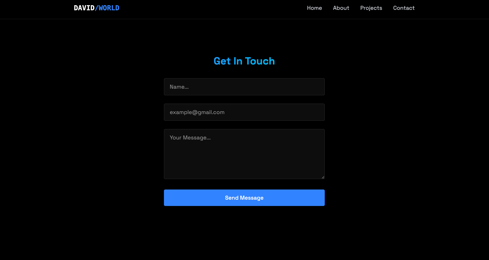

## ScreenShot





## Technologies

- **React:** Component-based UI library.
- **Vite:** Fast and lean development build tool.
- **TailwindCSS:** Utility-first CSS framework.
- **JavaScript (ES6+):** Modern JavaScript features and best practices.

## How to run

1. Code

   ```bash
   npm install
   npm run dev
   ```

## Folder Structure

```
your-portfolio/
├── public/
│   └── index.html
├── src/
│   ├── components/
│   │   ├── Navbar.jsx
│   │   ├── MobileMenu.jsx
│   │   ├── LoadingScreen.jsx
│   │   └── sections/
│   │       ├── Home.jsx
│   │       ├── About.jsx
│   │       ├── Projects.jsx
│   │       └── Contact.jsx
│   ├── index.css          # Tailwind base styles and global styles
│   ├── App.jsx
│   └── main.jsx
├── package.json
├── vite.config.js
└── README.md
```